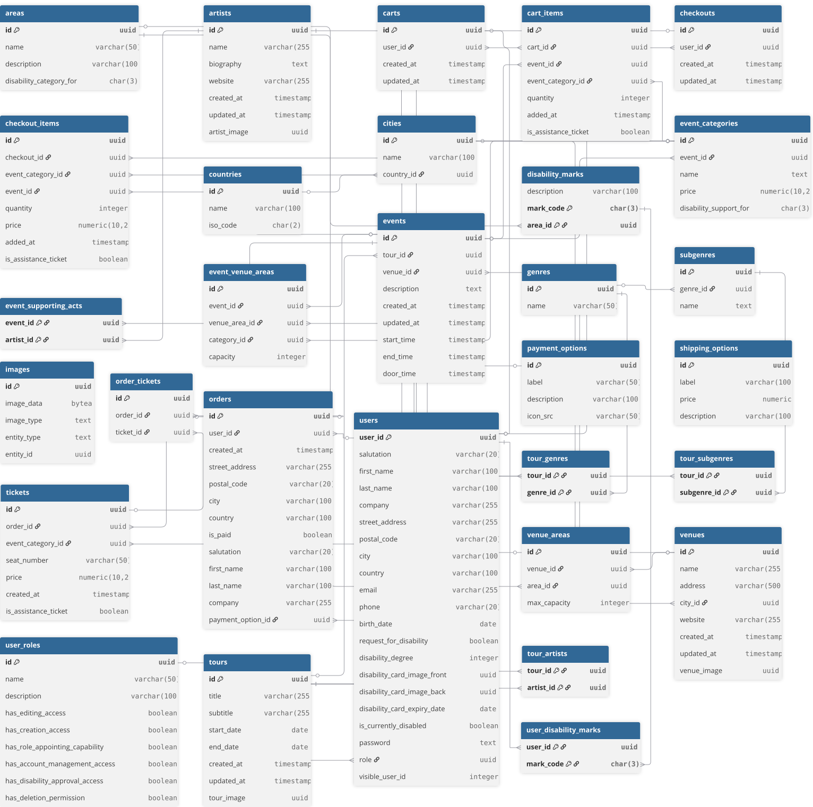

<link rel="stylesheet" href="./README.pdf.css" />

<div class="title-page">
  <h1>Eventim Disability Integration</h1>
  <p><em>Barrierefreie Abwicklung von Ticketbestellungen &amp; Nachteilsausgleichsanträgen der Evebtim-Webseite</em></p>
  <p><em>Version 1.0 – 29. Juli 2025</em></p>
</div>

<div class="pagebreak"></div>

# Eventim Disability Integration

Dieses Repository enthält eine Next.js Anwendung samt Express Backend, mit der Eventim eine barrierefreie Abwicklung von Ticketbestellungen und eine Verwaltung von Nachteilsausgleichsanträgen ermöglicht. Das Projekt gliedert sich in ein Frontend und einen Node.js Server im Unterordner `eventim-disability-integration`.

## Inhaltsverzeichnis

<!-- toc -->

- [Einleitung](#einleitung)
  * [Projekthintergrund und Motivation](#projekthintergrund-und-motivation)
  * [Aktuelle Herausforderungen](#aktuelle-herausforderungen)
  * [Gesellschaftlicher und rechtlicher Kontext](#gesellschaftlicher-und-rechtlicher-kontext)
- [Projektvision und Zielsetzung](#projektvision-und-zielsetzung)
  * [Kernfunktionalitäten](#kernfunktionalitäten)
  * [Ziele](#ziele)
  * [Zielgruppen und Stakeholder](#zielgruppen-und-stakeholder)
  * [Interne Stakeholder](#interne-stakeholder)
- [Projektübersicht](#projektubersicht)
- [Setup](#setup)
  * [Installations-Guide](#installations-guide)
  * [Login-Daten](#login-daten)
- [Architektur und eingesetzte Technologien](#architektur-und-eingesetzte-technologien)
  * [Ordnerstruktur](#ordnerstruktur)
  * [Frontend](#frontend)
  * [Backend](#backend)
  * [Datenbank](#datenbank)
  * [Verwendete Technologien](#verwendete-technologien)
  * [Sessions](#sessions)
- [Security & Fault Tolerance](#security--fault-tolerance)
  * [Rollen und Zugriffsberechtigungen](#rollen-und-zugriffsberechtigungen)
  * [Doppelte Validierung zwischen Front- und Backend bei CRUD-Operations](#doppelte-validierung-zwischen-front--und-backend-bei-crud-operations)
  * [Ausfallsicherheit & Auto-Recovery](#ausfallsicherheit--auto-recovery)
- [Testkonzept](#testkonzept)
  * [User-Tests](#user-tests)
  * [Backend-Tests](#backend-tests)
- [Nächste Schritte](#nächste-schritte)
- [Anhang](#anhang)
  * [FAQ Section](#faq-section)
  * [Datenbank-Modell](#datenbank-modell)
  * [Versionen eingesetzter Technologien](#versionen-eingesetzter-technologien)
  * [Workflows](#workflows)

<div class="pagebreak"></div>

<!-- tocstop -->

## Einleitung <a name="einleitung"></a>

### Projekthintergrund und Motivation <a name="projekthintergrund-und-motivation"></a>

Die Eventim-Plattform ist eine der führenden Ticketing-Lösungen im deutschsprachigen Raum und verarbeitet jährlich Millionen von Ticket-Transaktionen für Konzerte, Festivals, Theater und Sportveranstaltungen. Trotz dieser marktführenden Position existiert eine bedeutende Lücke in der Barrierefreiheit und digitalen Inklusion für Menschen mit Behinderungen.


In Deutschland leben etwa 7,9 Millionen Menschen mit einer anerkannten Schwerbehinderung (Stand 2021). Diese Personengruppe hat nach dem Sozialgesetzbuch IX (SGB IX) und verschiedenen Landesgesetzen Anspruch auf Nachteilsausgleiche bei kulturellen Veranstaltungen. Die EU-Richtlinie zur Barrierefreiheit (European Accessibility Act) verpflichtet zudem bis 2025 zur digitalen Barrierefreiheit von Ticketing-Systemen.

## Projektvision und Zielsetzung

Vision: "Eventim wird zur ersten vollständig inklusiven Ticketing-Plattform, die Menschen mit Behinderungen den gleichen komfortablen, digitalen Zugang zu kulturellen Erlebnissen ermöglicht wie allen anderen Nutzern."

### Kernfunktionalitäten

- **Behindertenausweis-Verifizierung**
  - Zwei Einstiegspunkte
    - Registrierung eines neuen Benutzerkontos
    - Nachträgliche Beantragung über `/profile` möglich
  - Upload-Interface für Vorder- und Rückseite des Schwerbehindertenausweises

- **Automatisierte Nachteilsausgleiche**
  - Dynamische Darstellung von zusätzlichen Kategorien abhängig von Event und Venue, welche nur für diese Nutzergruppe buchbar sind und einen reduzierten Preis haben
  - Automatische Zubuchung eines kostenfreien Begleitpersonen-Tickets bei Buchung mit Merkzeichen "B" (Begleitperson) im Schwerbehindertenausweis

### Ziele

#### Primäre Ziele:

- Vollständige Integration der Disability-Features in die bestehende Plattform
- Eliminierung manueller Prozesse durch intelligente Verifizierung
- Erfüllung aller rechtlichen Anforderungen Erschließung einer neuen Zielgruppe mit signifikantem Marktpotential

#### Sekundäre Ziele:

- Reduzierung der Support-Anfragen um 70%
- Steigerung der Kundenzufriedenheit in der Zielgruppe
- Positionierung als Accessibility-Leader im Ticketing-Markt

### Zielgruppen und Stakeholder

#### Menschen mit Schwerbehinderung (Primary Users)

- Anzahl: ~7,9 Millionen in Deutschland
- Charakteristika: Diverse Behinderungsarten, unterschiedliche technische Affinität
- Bedürfnisse: Einfache, barrierefreie Buchung, automatische Vergünstigungen
- Pain Points: Aktuelle telefonische Buchung, Wartezeiten, Unsicherheit über Berechtigung

#### Begleitpersonen und Angehörige (Secondary Users)

- Anzahl: ~2–3 Millionen potentielle Nutzer
- Charakteristika: Oft technisch versierter, buchen stellvertretend
- Bedürfnisse: Transparente Abrechnung, klare Berechtigungsregeln

### Interne Stakeholder

#### Service-Mitarbeiter

- Anzahl: ~50 Personen im Customer Service
- Bedürfnisse: Effiziente Tools zur Antragsbearbeitung, reduzierte Anruflast
- Erfolgsmetriken: 60% weniger Disability-bezogene Tickets

#### Admin-User (Content-Manager, Venue-Manager)

- Anzahl: ~20 Power-User
- Bedürfnisse: Einfache Konfiguration von barrierefreien Bereichen
- Erfolgsmetriken: Reduzierte Setup-Zeit für neue Events

## Setup

### Installations-Guide

1. **Repository klonen** und in das Projekt wechseln:

```bash
git clone <repo-url>
cd EventimDisabilityIntegration/eventim-disability-integration
```

2. **Abhängigkeiten installieren**:

```bash
npm install
```

3. **Datenbankzugang konfigurieren**:

   Legen Sie im Verzeichnis `server` eine Datei `credentials.json` an. Beispiel:
```json 
{
  "host": "152.53.119.113",
  "port": 5433,
  "user": "postgres",
  "password": "example",
  "database": "db1",
  "sessionSecret": "example-secret"
}
``` 

4. **Entwicklungsumgebung starten**:

```bash
npm run dev
```

Damit starten sowohl das Next.js Frontend auf [http://localhost:3000](http://localhost:3000), das Backend unter [http://localhost:4000](http://localhost:4000) sowie P2M zur Überwachung der Datenbank- und Backendverbindung.

<a name="technologien"></a>

### Login-Daten

Im Zuge der Bewertung der Webseite bleibt es Ihnen offen, ob Sie sich selbst einen/mehrere eigene Accounts anlegen wollen oder ob sie bereits vordefinierte Accounts nutzen wollen. Folgende User wurden bereits gestellt und können genutzt werden:

| Rolle | E-Mail | Passwort |
| ----- | ------ | -------- |
| `USER` | testUser1@test.de | testUser1@test.de |
| `SERVICE` | testService1@test.de | testService1@test.de |
| `ADMIN` | testAdmin1@test.de | testAdmin1@test.de |

## Architektur und eingesetzte Technologien

Die Anwendung besteht aus einem [Next.js](https://nextjs.org/) Frontend und einem [Express](https://expressjs.com/) Backend. Als Datenbank kommt [PostgreSQL](https://www.postgresql.org/) zum Einsatz. Die Wahl fiel auf diese Kombination, da sie leichtgewichtig, gut erweiterbar und auch ohne großen Konfigurationsaufwand lokal ausführbar ist. Next.js liefert die React basierte Oberfläche und kann sowohl statische Seiten als auch serverseitig gerenderte Inhalte bereitstellen. Express dient als schlanker REST‑API Server, der über die `server`‑Ordnerstruktur umgesetzt ist. Die Kommunikation zwischen Frontend und Backend erfolgt ausschließlich über JSON‑basierte HTTP‑Aufrufe.

### Ordnerstruktur

Der gesamte Quellcode liegt im Ordner `eventim-disability-integration`. Die nachfolgende Tabelle bietet einen schnellen Überblick über alle relevanten Verzeichnisse:

| Pfad | Inhalt |
|------|-------|
| `src/pages/` | Sämtliche Next.js Seiten in `*.jsx`-Dateien. Unterordner wie `admin/` oder `artists/` bilden dynamische Routen ab und strukturieren den Code in für den Endnutzer intuitive Pfade |
| `src/components/` | Wiederverwendbare UI-Bausteine (Modals, Navigationsleisten, Karten usw.) |
| `src/hooks/` | Custom Hooks wie `useAuth` oder `useCart`, die zentrale Logik kapseln, welche auf mehreren Seiten/in mehreren Komponenten benötigt wird|
| `src/__tests__/` | Jest-Tests zur automatisierten Durchführung von  Backend-Tests zur Sicherstellung der Verfügbarkeit aller REST-API-Endpunkte |
| `server/` | Express‑Backend (`server.js`), DB-Anbindung (`db.js`), `backup_script.sql` und PM2-Konfiguration |
| `public/` | Statische Dateien, die unverändert von Next.js bereitgestellt werden (bspw. Icons, Logos usw.)|

<a name="frontend"></a>

### Frontend

Das Frontend einer Applikation ist die sichtbare Benutzeroberfläche (UI), über die Anwender mit den Funktionen und Daten der Anwendung arbeiten. Es ist aufgeteilt in Seiten (Pages) unter `/pages`, welche sich in Darstellung, Daten und Funktionalität unterscheiden. Nutzer können über das Frontend Abläufe der APplikationslogik starten, welche über das Backend und den Browser dynamisch Daten abrufen, sichern oder manipulieren.

Im Frontend der Applikation wurde Next.js in Kombination mit React eingesetzt, weil diese Lösung serverseitiges Rendering ermöglicht und eine klare Komponentenstruktur vorgibt. Alternative Umsetzungen wären etwa mit Vue.js/Nuxt oder Angular möglich gewesen, jedoch besitzt das Team bereits umfangreiche Erfahrung mit React, was die Wartung vereinfacht.

#### Seitenübersicht

Die Next.js Anwendung befindet sich unter `src/pages` und nutzt dynamische Routen. Wichtige Seiten sind:

| Pfad | Zweck / Inhalte |
|------|----------------|
| `/` | Startseite mit Highlights sowie Künstler- und Tourübersicht |
| `/artists/[artist]` | Detailseite eines Künstlers und Übersicht zugehöriger aktiver Touren und deren Events |
| `/artists/[artist]/[tour]` | Übersicht aller Events einer ausgewählten Tour inkl. Verfügbarkeit von Tickets und Information über verfügbare barrierefreie Kategorien |
| `/artists/[artist]/[tour]/[event]` | Detailseite eines Events, verfügbarer Kategorien sowie die Möglichkeit, Tickets in den Warenkorb zu legen |
| `/registration` | Formular zur Kontoerstellung und Beantragung eines Nachteilsausgleichs mit Erstellung des Nutzerkontos |
| `/login` | Anmeldungsseite |
| `/profile` | Übersicht über gebuchte Events, getätigte Bestellungen, Verwaltung persönlicher Daten sowie einer FAQ-Section. Falls der Nutzer noch keinen Nachteilsausgleich beantragt hat kann dieser das hier tun oder den Status seines Antrags einsehen |
| `/checkout` | Mehrstufiger Bestellprozess (Versanddaten, Zahlung, Abschluss) zur Buchung von Tickets |
| `/admin` | Einstieg in alle Admin-Unterseiten zur Pflege von Künstlern, Ländern, Genres, Touren und Veranstaltungsorten |
| `/service` | Zugriffspunkt für Service-Mitarbeiter (u.a. Nachteilsausgleichsanträge und Account-Management) zur Verwaltung von Nachteilsausgleichanträgen und Nutzerdaten zum Nachgang der telefonischen Servicetätigkeiten |

Alle Seiten unter `/admin/*` und `/service/*` setzen entsprechende Berechtigungen voraus und sind nur Admin- bzw. Servicemitarbeitern gestattet. Falls ein Nutzer, welcher entweder nicht angemeldet ist oder nicht die notwendigen Berechtigungen besitzt auf diese Webseite geht, so wird dieser auf die Homepage zurückgewiesen.

Die Möglichkeit, einen Nachteilsausgleich als schwerbehinderte Person zu beantragen ist sowohl bei der Registrierung als auch nachträglich im Benutzerprofil möglich. Die Buchung von Tickets mit Nachteilsausgleich erfolgt über genannte Routen zur Buchung von Tickets und beinhaltet weitere Kategorien spoezifisch für schwerbehinderte Nutzer, welche nur Nutzer buchen können mit validierten Schwerbehindertenstatus durch einen Service-Nutzer.

Im Folgenden wird das Backend der Applikation beschrieben.

<a name="backend"></a>

### Backend

Das Backend ist die serverseitige Schicht, die HTTP‑Anfragen des Frontends entgegennimmt, über die Applikationslogik verarbeitet und anschließend auf die Datenbank zugreift, um Daten zu speichern oder abzurufen. Es stellt sogenannte Endpunkte zur Verfügung, mit denen die Applikationslogik über HTTP‑Methoden (GET, POST, PUT, DELETE) angesprochen wird, um CRUD‑Operationen auf den Daten auszuführen und diese in der Datenbank festzuhalten. Die Applikation nutzt einen lokal laufenden Server, der über das Skript `server/server.js` gestartet wird und unter http://localhost:4000/ erreichbar ist.

Im Backend der Applikation wurde Express als leichtgewichtiges Framework eingesetzt, da es eine minimalistische Struktur besitzt und Middleware sehr flexibel eingebunden werden kann. Im Gegensatz zu komplexeren Lösungen wie NestJS ermöglicht Express einen schnellen Einstieg und volle Kontrolle über den Request-Flow. Alternative Umsetzungen wären mit NestJS oder Fastify möglich gewesen, doch Express ist in der Node.js-Community weit verbreitet und dementsprechend ausgezeichnet dokumentiert.

#### REST-Endpunkte

Im Folgenden sind die wichtigsten Routen des Express-Servers (siehe `server/server.js`) aufgeführt:

| Methode | Pfad | Beschreibung |
|---------|------|--------------|
| `POST`  | `/users` | Registrierung eines neuen Nutzers inkl. optionaler Behindertenausweis-Daten |
| `POST`  | `/sessions` | Benutzeranmeldung, legt Session-Cookie an |
| `GET`   | `/session` | Prüft, ob ein Nutzer eingeloggt ist und liefert Profilinformationen |
| `DELETE` | `/session` | Beendet die aktuelle Session |
| `GET`   | `/users/me/address` | Liefert die hinterlegte Anschrift des eingeloggten Nutzers |
| `GET`   | `/disability-marks` | Auflistung möglicher Markierungen des Behindertenausweises |
| `GET`   | `/disability-requests/pending` | Offene Anträge auf Nachteilsausgleich für den Service-Bereich |
| `PATCH` | `/disability-requests/:id/accepted` | Antrag eines Nutzers akzeptieren |
| `PATCH` | `/disability-requests/:id/declined` | Antrag eines Nutzers ablehnen |
| `GET`   | `/artists` | Auflistung aller Künstler |
| `POST`  | `/artists` | Neuen Künstler anlegen |
| `GET`   | `/tours/detailed` | Touren inkl. Events und Zugänglichkeitsdaten |
| `POST`  | `/tours` | Neue Tour anlegen |
| `GET`   | `/venues/detailed` | Liste aller Veranstaltungsorte mit Areas |
| `POST`  | `/venues` | Neuen Veranstaltungsort anlegen |
| `POST`  | `/cart-items` | Ticket zur Warenkorb-Session hinzufügen |
| `GET`   | `/checkout` | Aktuellen Checkout laden |
| `POST`  | `/orders` | Bestellung aus abgeschlossenem Checkout erzeugen |

Aus Platzgründen wurde auf die Darstellung aller Backend-Routen verzichtet. Weitere Endpunkte finden sich direkt im Quellcode von `server/server.js`.

Die Endpunkte folgen den Best Practices von REST-API-Schnittstellen und halten konsequent Ressourcenorientierung, sprechende URLs sowie eindeutige HTTP-Statuscodes ein. Darüber hinaus wurde bei der Konstruktion der Endpunkte auf eine einheitliche Fehlerbehandlung und eine klare Trennung zwischen Daten- und Geschäftslogik geachtet.

Im Folgenden wird die verwendete Datenbank sowie deren Tabellen betrachtet.

<a name="datenbank"></a>

### Datenbank

Eine Datenbank ist eine Anwendung, die Daten anhand eines vordefinierten Schemas organisiert, dauerhaft ablegt und über standardisierte Schnittstellen abfragbar macht. Realisiert werden diese Abfragen mittels einer Library

Die eingesetzte Datenbank basiert auf PostgreSQL und wurde einmalig über `server/backup_script.sql` erstellt. Enthalten sind Tabellen für Benutzer, Rollen, Künstler, Touren, Events, Veranstaltungsorte sowie Tabellen zur Abwicklung von Bestellungen und zur Speicherung von Disability-Merkmalen. Hierbei wurde darauf geachtet, dass alle Metadaten ebenfalls in der Datenbank angepasst werden können, somit flexibel angepasst und erweitert werden können.

Es wurde sich für eine PostgreSQL Datenbank entschieden, da diese ACID-konforme Transaktionen sowie eine ausgereifte Query-Engine bietet und gleichzeitig JSON-Datenstrukturen unterstützt. Alternativen wie MySQL oder MongoDB wurden geprüft, jedoch erschien PostgreSQL aufgrund der breiten Community-Unterstützung und der stabilen Erweiterbarkeit am sinnvollsten.

Über das `pg`-Modul von PostgreSQL wird zwischen Backend und Datenbank ein Connection-Pool aufgebaut, welcher eine effiziente Verwaltung von Datenbankverbindungen ermöglicht. Diese Technik reduziert den Overhead beim Öffnen und Schließen von Verbindungen erheblich und verbessert dadurch die Performance des Systems. Der Pool wird beim Start des Servers initialisiert und bleibt während der gesamten Laufzeit bestehen.

Die Kommunikation erfolgt über parametrisierte SQL-Queries, die vor SQL-Injection-Angriffen schützen. Sollte die Datenbankverbindung unterbrochen werden, versucht der in `server/db.js` implementierte Circuit-Breaker automatisch, den Pool neu zu initialisieren. Diese Architektur gewährleistet eine robuste und ausfallsichere Datenpersistenz für alle Transaktionen der Anwendung.

Im Folgenden ein Überblick über die wichtigsten Datenbanktabellen und ihre Beziehungen zueinander.

#### Datenbanktabellen



Zu sehen sind alle verwendeten Datenbanktabellen sowie ihre Beziehungen zueinander. Die Datenbank liegt normiert in 3. Normalform vor, um Redundanzen in Daten und Abhängigkeiten sowie Anomalien vorzubeugen. Zur Sicherstellung von Datenintegrität kann jedes Element jeder Tabelle mittels seiner eindeutigen V4-UUID identifiziert werden. Fremdschlüsselbeziehungen

Für einfache Lookups existieren diverse Join‑Tabellen (z. B. `tour_genres`). Bei der Konstruktion des Datenbankmodells wurde stets darauf geachtet, dass die Datenbank in dritter Normalform vorliegt, somit Anomalien durch Löschen oder Anpassungen von Daten weitesgehend midigiert werden können.

Eine detaillierte Ansicht aller Tabellen, eine zugehörige Beschreibung sowie ihre Zusammenhänge zueinander befindet sich im Anhang.

Im Folgenden werden weitere Technologien beschrieben, welche als Runtime / Framework / Library in den Code der Applikation eingebunden wurden.

<a name="komponenten-hooks"></a>

## Verwendete Technologien

### Frameworks & Libraries

Neben den eingesetzten Frameworks wurden in diesem Projekt mehrere Libraries eingebunden, welche im Folgenden aufgelistet werden.

| Komponente/Bibliothek | Kategorie | Zweck |
|-----------------------|-----------|-------|
| **Node.js** | Runtime | Ausführung von Backend und Next.js |
| **Next.js** | Framework | React-basiertes Frontend mit Server Side Rendering |
| **React** | Library | UI-Komponenten im Browser |
| **Express** | Backend Framework | REST‑API und Routing |
| **PostgreSQL** | Datenbank | Persistente Speicherung aller Daten |
| **pg** | Library | Zugriff auf PostgreSQL im Backend |
| **bcrypt** | Library | Hashing von Passwörtern |
| **multer** | Library | Verarbeiten von Datei‑Uploads (multipart/form-data) im Server zur Speicherung in der DB |
| **react-router-dom** | Library | Clientseitige Navigation |
| **react-toastify** | Library | Anzeigen von Toast‑Benachrichtigungen |
| **opossum** | Library | Circuit‑Breaker für Fehlerbehandlung und automatisierte Neustarts |
| **PM2** | Tool | Prozessmanager für den Server zur Absicherung der Applikation gegenüber Störungen |
| **nodemon** | Tool | Automatischer Neustart im Entwicklungsmodus |
| **uuid** | Library | Erzeugen eindeutiger V4 UUIDs |
| **Testing Library / Jest** | Testframeworks | Unit‑ und Integrationstests für Frontend (und bei Bedarf Backend) |

Es wurde insbesondere `react-toastify` genutzt, um auf der Seite ein konsistentes Benachrichtigungssystem umzusetzen. Darüber hinaus sorgen `opossum` und `PM2` für eine resiliente Fehlerbehandlung im Backend und einen stabilen Betrieb.

### 

Eine Komponente im Kontext dieser Arbeit ist ein kapselbarer UI-Baustein auf React-Basis, wohingegen ein Hook wiederverwendbare Logik wie Zustandsverwaltung oder Seiteneffekte abbildet. Beide Konzepte eignen sich dazu, komplexe Abläufe zu abstrahieren und die Wiederverwendbarkeit des Codes signifikant zu erhöhen.

Der Quellcode unter `src` gliedert sich in wiederverwendbare React‑Komponenten und mehrere Custom Hooks, welche auf mehreren Seiten implementiert wuden

#### Komponenten

| Datei | Einsatz |
|-------|--------|
| `nav-bar.jsx` | Hauptnavigation mit Suche und Warenkorb-Anzeige |
| `footer.jsx` | Gemeinsamer Seitenfuß |
| `LoadingOverlay.jsx` | Überblendet die Seite während Daten geladen werden |
| `DisabilityRequestModal.jsx` | Dialog zur Beantragung eines Nachteilsausgleichs |
| `DeleteAccountModal.jsx` | Bestätigungsdialog zum Löschen des Accounts |
| `smallArtistCard.jsx` / `smallTourCard.jsx` | Vorschaukarten auf der Startseite |

Die Komponenten sind so aufgebaut, dass sie in verschiedenen Seiten wiederverwendet werden können. Jede Komponente wurde nach dem Prinzip der Single Responsibility entwickelt und nutzt Props für die Datenweitergabe. Beispielsweise rendert `smallArtistCard.jsx` einen Künstler in verschiedenen Kontexten (Startseite, Suche, Verwaltung) mit konsistenter Darstellung aber unterschiedlichen Callback-Funktionen. Die Komponenten implementieren zudem das React-Memoization-Pattern, wodurch unnötige Re-Renderings vermieden und die Performance optimiert wird.

#### Hooks

| Hook | Zweck |
|------|------|
| `useAuth` | Kümmert sich um Login‑Status und hält Userdaten clientseitig vor |
| `useCart` | Verwaltet den Warenkorb und lädt Items vom Server |
| `useRequireAccess` | Leitet unberechtigte Nutzer auf die Login‑Seite um |
| `useValidation` | Hilft bei Formularvalidierungen |

Die Hooks kapseln wiederverwendbare Geschäftslogik und stellen eine konsistente Schnittstelle zum Backend bereit. Während `useAuth` Session-Management und Berechtigungsprüfung implementiert, orchestriert `useCart` die asynchrone Kommunikation mit dem Server für Warenkorb-Operationen. Diese modulare Struktur reduziert Redundanz und garantiert einheitliches Verhalten über die gesamte Anwendung hinweg.

### Sessions

Eine Session ist eine temporäre Verbindung zwischen Client und Server, die Benutzerdaten während der Interaktion mit einer Webanwendung speichert. Die Anwendung nutzt serverseitiges Session-Management mittels `express-session`. Die Session-Verwaltung basiert auf einem Cookie-basierten Ansatz, bei dem der Browser nur eine einzigartige Session-ID enthält, während die eigentlichen Session-Daten sicher auf dem Server verbleiben.

#### Session-Architektur

- **Session-ID**: Wird als Cookie namens `sid` im Browser gespeichert
- **Session-Store**: Standardmäßig nutzt die Anwendung einen `MemoryStore` im Express-Server
- **Lebensdauer**: Sessions sind auf ihre Lebensdauer begrenzt, verlängern sich jedoch bei Aktivität
- **Sicherheit**: Die Cookies werden mit dem Flag `httpOnly` gesendet, um Client-seitigen JavaScript-Zugriff zu verhindern

#### Gespeicherte Daten

In den Sessions werden abhängig vom Anwendungsfall verschiedene Informationen gespeichert:

| Session-Typ | Gespeicherte Daten | Lebensdauer |
|-------------|-------------------|-------------|
| **Login-Session** | `userId`, `email`, Rollenrechte | 60 Minuten |
| **Checkout-Session** | Warenkorb-Items, Versand- und Zahlungsdaten | 15 Minuten Inaktivität |

#### Session-Workflow

1. Bei Anmeldung erstellt der Server eine neue Session und füllt sie mit Benutzerdaten
2. Während der Navigation werden Session-Daten genutzt, um Berechtigungen zu prüfen
3. Im Kaufprozess werden Artikel und Checkout-Informationen in der Session gespeichert
4. Bei Abmeldung oder Timeout wird die Session zerstört

Die Session-Daten werden serverseitig validiert, um unbefugte Zugriffe oder Manipulationen zu verhindern. Dies ist besonders wichtig für die Rollenverwaltung und Berechtigungsprüfungen beim Zugriff auf geschützte Bereiche der Anwendung.

## Security & Fault Tolerance

### Rollen und Zugriffsberechtigungen

Die Tabelle `user_roles` definiert Berechtigungen. Aktuell existieren drei Rollen:

| Rollenname | Beschreibung | Edit Entities | Create Entities | Appoint Roles | Delete Entities | Disability Approval | Account Mgmt |
|------|--------------|------|--------|---------------|--------------|--------------------|--------|
| **user** | Regulärer Eventim Nutzer | `false` | `false` | `false` | `false` | `false` | `false` |
| **service** | Service-Mitarbeiter von Eventim | `false` | `false` | `false` | `false` | `true` | `true` |
| **admin** | Admin-Nutzer (alle Rechte) | `true` | `true` | `true` | `true` | `true` | `true` |

Damit wird garantiert, dass nur Nutzer mit Berechtigungen ausgewählte Aktionen durchführen dürfen und Rechte durch einen Administrator verwaltet werden können. Hierbei wurde zusätzlich darauf geachtet, dass im System mindestens ein Administrator bestehen muss, indem diesem das Löschen seines eigenen Accounts verweigert wird, sofern kein anderer Admin existiert.

Zusätzlich ist es Nutzern mit fehlenden Berechtigungen nicht möglich, auf Seiten zu navigieren, zu denen sie keine Berechtigung haben, indem in der Login-Session die Rollenrechte des Nutzers gespeichert werden und auf ausgewählten Seiten abgefragt wird, ob diese erfüllt sind oder nicht. Sind diese nicht berechtigt, die Seite aufzurufen, so werden sie mittels eines `307: Temporary Redirect` auf die Ursprungsseite zurückverwiesen.

### Doppelte Validierung zwischen Front- und Backend bei CRUD-Operations

Um im Falle eines Datenbank- oder Backend-Fehlers dem Nutzer weiterhin ein funktionsfähiges System zu bieten, werden Fehlerzustände serverseitig abgefangen und dem Frontend in strukturierter Form gemeldet. Beim Versuch, eine Tour bzw. ein Event zu löschen validiert zunächst das Frontend, ob zu dieser Tour/ einem Event dieser Tour bereits Tickets existieren. Nur wenn keine Tickets in `orders` hinterlegt sind, erscheint die Möglichkeit das Event zu löschen.

Sollte das Frontend in einen Fehler laufen und dennoch ein "Löschen"-Icon anzeigen wirft das Backend in `server/server.js` einen Fehler, dass diese Aktion nicht erlaubt ist, bevor dads Event auf der Datenbank gelöscht wird. Dieser wird vom Frontend entgegengenommen und in Form einer Fehlermeldung dem User angezeigt, dass die von ihm durchgeführte Aktion nicht möglich ist.

Folgende Fälle werden durch die Applikation abgedeckt:

| Komponente                   | HTTP-Operation | Verhalten                                       |
| ---------------------------- | -------------- | ----------------------------------------------- |
| Admin-Bereich                | `GET`          | Weiterleitung zur Login-Seite bei fehlenden Rechten |
| Stadt                        | `DELETE`       | Popup: Stadt in Stadion genutzt                |
| Venue                        | `DELETE`       | Popup: Tickets vorhanden, Löschen nicht möglich |
| Land                         | `DELETE`       | Popup: Städte in Stadion genutzt               |
| Nutzerkonto                  | `DELETE`       | Fehler: bestehende Buchungen verhindern Löschung |
| Event                        | `DELETE`       | Löschen nicht möglich bei verkauften Tickets   |
| Tour                         | `DELETE`       | Löschen nicht möglich bei gebuchten Events     |
| Artist                       | `DELETE`       | Künstler nicht löschbar                        |
| Genre                        | `DELETE`       | Popup: Genre in Tour genutzt                   |
| Sub-Genre                    | `DELETE`       | Popup: Sub-Genre in Tour genutzt               |
| Ticketkauf                   | `PUT`          | Button ausgegraut bei Maximalanzahl            |
| SB-Antrag     | `DELETE`       | Antrag wird entfernt                           |
| Event-Sitzplatzkonf. | `POST`         | Fehler: Kategorie-Wert muss > 0 sein            |
| SB-Ticketkauf | `POST`         | Button ausgegraut, Kauf blockiert              |

Umgesetzt wird dies durch ein Zusammenspiel aus clientseitigen Guards und serverseitiger Validierung, welche jede Manipulation der Daten prüft. Diese doppelte Validierung erlaubt es, dass die Daten trotz Fehler in Front- und Backend nicht fehlerhaft auf der Datenbank gesichert/manipuliert werden.

### Ausfallsicherheit & Auto-Recovery

Im Falle eines Absturz des Backends oder der Datenbank wird dieses durch die Verwendung von `PM2` und `opossum` automatisch neugestartet. Übersteigt die Antwortzeit einer Datenbank-Query den in `opossum` gesetzten Timeout, werden Requests an die Datenbank blockiert. `PM2` startet dann einen neuen Worker, der Timer wird zurückgesetzt und ein neuer Connection-Pool zwischen Datenbank und Backend aufgebaut.

Die Ausfallsicherheit wird durch mehrere Maßnahmen gewährleistet:

- `server/db.js` implementiert einen Circuit-Breaker auf Basis von `opossum`, der bei Datenbankfehlern nach 5 Sekunden einen Reconnect versucht und verhindert, dass wiederholte Fehler das System überlasten
- `server/server.js` startet erst, wenn eine stabile DB-Verbindung besteht, und führt alle 15 Minuten Aufräumjobs für abgelaufene Sessions durch
- Der Express-Server läuft unter **PM2** im Cluster-Modus, wodurch bei Abstürzen ein Neustart erfolgt
- Periodische Health-Checks alle 10s prüfen die Verbindung zur Datenbank und lösen bei Bedarf einen kontrollierten Neustart aus
- Ungefangene Exceptions werden zentral protokolliert und führen zu einem geordneten Exit-Code, damit PM2 sofort einen neuen Prozess starten kann

Diese Architektur gewährleistet, dass temporäre Datenbankausfälle oder Speicherprobleme die Anwendungsverfügbarkeit nur minimal beeinträchtigen und das System selbstständig in einen funktionsfähigen Zustand zurückkehrt.

## Testkonzept

Zur Validierung der Ergebnisse aus der Applikation werden Tests durchgeführt, die sowohl Unit- als auch Integrationstestfälle umfassen. Geprüft werden hierbei die REST-Endpunkte des Backends, die Funktionsweise der React-Komponenten sowie komplette Nutzerflüsse mittels End-to-End-Tests.

### User-Tests

User-Tests bezeichnen systematische Überprüfungen, bei denen reale Benutzer mit dem System interagieren, um dessen Benutzerfreundlichkeit, Funktionalität und Zuverlässigkeit zu bewerten. Bei diesen Tests werden typische Anwendungsfälle durchgespielt, um Probleme zu identifizieren, bevor sie in der Produktivumgebung auftreten.

In unserem Fall konzentrieren sich die User-Tests auf folgende Aspekte:
- Zugriffsberechtigungen und Rollenbeschränkungen
- Datenkonsistenz bei Löschoperationen
- Validierung von Eingaben und Geschäftsregeln
- Barrierefreiheit und Behindertenunterstützung

Die Tests simulieren reale Nutzungsszenarien und prüfen, ob das System wie erwartet reagiert, besonders in Grenzsituationen wie dem Versuch, mehr Tickets zu kaufen als verfügbar sind oder Daten zu löschen, die noch in Verwendung sind.


Als Normalnutzer wurde zunächst versucht, durch direkte Eingabe der URL „/admin/<unterseite>“ auf den Admin-Bereich zuzugreifen (TC01). Das System leitete jedoch konsequent auf die Anmeldeseite um. Anschließend folgte eine Reihe von Löschtests: Beim Versuch, eine Stadt zu entfernen, in der bereits ein Event existiert (TC02), erschien ein Popup mit dem Hinweis, dass das Löschen fehlschlug, weil Städte dieses Landes in einem Stadion verwendet werden. Gleiches geschah beim Löschen einer Venue mit bestehendem Event (TC03); hier meldete das System, die Venue könne nicht entfernt werden, da Tickets für Events existieren. Auch das Löschen eines Landes, in dem Events stattfinden (TC04), wurde mit einem entsprechenden Fehler-Popup verhindert, das erneut auf verwendete Städte verwies.

Der Versuch, einen Nutzer direkt über die Benutzeroberfläche zu löschen, obwohl noch Buchungen für zukünftige Veranstaltungen bestehen (TC05), scheiterte ebenfalls: Unterhalb der Darstellung erschien der Text, das Konto könne nicht gelöscht werden, solange Tickets für noch nicht stattgefundene Events vorhanden sind. Ein Event mit bereits verkauften Tickets zu löschen (TC06) war gar nicht erst vorgesehen – die Option existierte schlicht nicht; dasselbe galt für das Entfernen einer Tour, die Events mit verkauften Tickets enthält (TC07). Artists ließen sich generell nicht löschen (TC08). Beim Versuch, ein Genre zu entfernen, für das bereits Tickets eines Events existieren (TC09), zeigte das System ein Popup, das einen Fehler beim Löschen meldete und als mögliche Ursache eine Tour-Verknüpfung nannte. Identisch verhielt es sich beim Sub-Genre (TC10): Auch hier verhinderte ein Fehlerhinweis das Löschen und verwies auf eine mögliche Verbindung zu einer Tour.

Ein weiterer Test zielte darauf ab, mehr Tickets zu bestellen, als tatsächlich vorhanden waren (TC11). Wurde ein Event mit nur einem Ticket angelegt und der Nutzer versuchte, mehr zu kaufen, graute sich der Kauf-Button bei Erreichen der maximalen Ticketanzahl aus, sodass ein weiterer Erwerb unmöglich war. Interessant war auch der Fall, in dem ein Nutzer sein Konto löschen wollte, obwohl noch ein offener Schwerbehindertenantrag bestand (TC12): Statt den Löschvorgang zu blockieren, entfernte das System den Antrag aus der Liste offener Anträge.

Beim Anlegen eines Events in einer Venue mit Behindertenbereich wurde geprüft, ob sich Sitzplätze – egal ob regulär oder für Schwerbehinderte – komplett weglassen lassen (TC13). Das System erlaubte dies nicht: Kategorien bzw. Sitzplätze müssen einen Wert größer null haben, womit gesetzliche Vorgaben eingehalten werden. Schließlich wurde getestet, ob mehrere Schwerbehindertentickets (etwa Sondertickets oder Gratis-Begleitpersonen) gleichzeitig gekauft werden können (TC14). Auch das war nicht möglich: Der „In den Warenkorb“-Button blieb ausgegraut und ließ sich nicht anklicken.

### Backend-Tests

Die automatisierten Backend-Tests nutzen Jest und prüfen alle API-Routen auf korrekte Antwortcodes sowie auf die Validierung der Eingabedaten. Hierbei wird eine isolierte Testdatenbank verwendet, damit produktive Daten nicht beeinflusst werden.

<a name="next-steps"></a>

## Nächste Schritte
Das Grundgerüst funktioniert lokal stabil: Registrierung, Login, Rollenverwaltung und der Bestellprozess sind lauffähig. Das Projekt ist in Frontend und Backend klar getrennt und setzt auf PostgreSQL als persistente Datenbasis.

Vor einer finalen Bereitstellung sollten noch folgende Punkte bearbeitet werden:

1. **Konfiguration bereinigen** – Secrets in Umgebungsvariablen auslagern und Produktionsbuilds automatisieren.
2. **Security prüfen** – HTTPS erzwingen, CORS-Regeln präzisieren und optionale 2FA vorsehen.
3. **Fehlertoleranz weiter ausbauen** – zentrales Logging und Alerting einrichten.

Bereits sehr gut funktionieren das Rollenmodell, die Bild-Uploads sowie die periodische Datenbereinigung im Backend.

<a name="appendix"></a>

## Anhang

## FAQ Section

### Wie kann die Architektur beschrieben werden?

- Womit interagiert der Endnutzer
  - Der Endnutzer arbeitet über einen Browser mit dem in Next.js entwickelten Frontend. Von dort werden REST-Aufrufe an das Express-Backend geschickt. Direkten Kontakt zur Datenbank gibt es nicht.
- Womit interagiert der Endnutzer nicht
  - Der Endnutzer hat keinerlei direkte Verbindung zu Server oder Datenbank. Alle technischen Details wie Session-Verwaltung oder Datenbankzugriffe laufen vollständig im Backend ab, ohne dass der Nutzer darauf zugreifen kann.
- Wie sind Applikation und Server verbunden
  - Das Frontend läuft in einem Next.js-Server, der als Client im Browser ausgeführt wird, und kommuniziert per HTTP/REST mit dem Express-Server auf Port 4000. In der `NEXT_PUBLIC_API_URL` wird definiert, unter welcher Adresse die API erreichbar ist.
- Wie sind Server und Daenbank verbunden bzw tauschen Daten aus
  - Der Express-Server nutzt das `pg`-Modul, um über einen Connection-Pool auf die PostgreSQL-Datenbank zuzugreifen. Die Verbindungskonfiguration liest er aus `credentials.json`. Anfragen werden durch einen `opossum`-Circuit-Breaker geleitet, der bei Fehlern den Pool neu aufbaut.
- wie könnte ich eine Grafik mit folgenden Komponenten bauen: Server, Datenbank, Applikation, Sessions, Browser, Endnutzer
  - Ein mögliches Architekturdiagramm zeigt den Browser des Nutzers, der über HTTPS auf das Next.js-Frontend zugreift. Dieses ruft per REST den Express-Server auf, der Sessions in `express-session` verwaltet und über `pg` mit der PostgreSQL-Datenbank spricht. Pfeile zwischen den Komponenten verdeutlichen die Datenflüsse.

### Wie funktionieren Sessions?

- Wo werden wie Sessions verwaltet (bspw. beim Checkout oder Login)?
  - Die Sessions werden serverseitig mit `express-session` gehalten. Beim Login speichert der Server im Session-Objekt die Nutzer-ID und Berechtigungen. Beim Checkout legt er ein Unterobjekt `checkout` an, in dem Versand- und Zahlungsdaten während des Kaufvorgangs liegen.
- Wie sind die Sessions aufgebaut?
  - Jede Session besteht aus einem Cookie mit dem Namen `sid`, das im Browser hinterlegt ist, und einem dazugehörigen Servereintrag im MemoryStore. Dort liegen Attribute wie `userId`, `email`, diverse Rollenrechte sowie das `checkout`-Objekt. Die Daten sind also in einem JS-Objekt strukturiert.
- Welche Daten werden in welcher Session wie lange gespeichert?
  - Die Login-Session speichert Nutzerdaten eine Stunde lang, da die Cookie-Option `maxAge` auf 3600000 Millisekunden steht. Daten des Checkout-Vorgangs werden zusätzlich im `checkout`-Objekt abgelegt und nach 15 Minuten Inaktivität verworfen.
- Wo werden die Daten genau gespeichert die in einer Session sind, macht das der Browser oder wer sonst?
  - Die eigentlichen Sessiondaten liegen ausschließlich im Node.js-Server und werden standardmäßig in dessen Speicher abgelegt. Der Browser hält nur die Session-ID im Cookie. Bei jedem Request sendet er dieses Cookie mit, sodass der Server die zugehörigen Daten finden kann.

### Wie genau werden Bilder gespeichert?

- Wie werden die Bilder von .png bzw .jpeg in ein Format umgewandelt was die Datenbank speichert?
  - Der Server nimmt hochgeladene PNG- oder JPEG-Dateien über `multer` entgegen. Da wir den Speicher auf `memoryStorage` gesetzt haben, liegen sie bereits als Buffer im Arbeitsspeicher. Dieser Binärpuffer wird anschließend direkt in die Spalte `image_data` der Tabelle `images` geschrieben.
- in welcher Form bekommt der Server die Bilddaten und wie werden diese dann in images gespeichert?
  - Durch das Multer-Middleware bekommt `server.js` die hochgeladenen Dateien in `req.file` beziehungsweise `req.files` als Buffer zusammen mit dem MIME-Type. Jeder Upload erhält eine UUID als ID. Anschließend wird `INSERT INTO images (id, image_data, image_type)` ausgeführt, sodass Buffer und Typ persistiert werden.
- wie werden Bilder aus der Datenbank geholt
  - Zum Abruf stellt das Backend die Route `/image/:id` bereit. Dort wird per `SELECT image_data, image_type FROM images WHERE id = $1` das gespeicherte Binary geladen. Danach setzt der Server den Content-Type auf den gespeicherten MIME-Wert und sendet die Daten als HTTP-Response zurück.
- wie erfolgt die Umwandlung vom Format der Datenabank in ein Bild?
  - Im Browser geschieht keine Konvertierung: das Backend liefert das Bild bereits mit korrektem MIME-Type aus. Der Browser interpretiert den Content-Type und stellt das Binary direkt als Bild dar. Es wird also nur übertragen und nicht nochmals transformiert.

### Wie genau funktionieren Hooks?

- Was ist der Sinn von Hooks?
  - React-Hooks ermöglichen es, in Funktionskomponenten zustandsbehaftete Logik und Nebeneffekte zu kapseln. Mit `useState` werden lokale Zustände verwaltet, `useEffect` führt Code bei bestimmten Änderungen aus. Dadurch bleibt der Code schlanker und wiederverwendbar.
- Wie genau werden Hooks in diesem Code genutzt?
  - In den React-Seiten wie `login.jsx` und den Checkout-Komponenten werden `useState` und `useEffect` eingesetzt, um Formularfelder zu steuern und API-Daten zu laden. Beispielsweise speichert `useState` die E-Mail im Login-Formular und `useEffect` ruft Versand- oder Zahlungsoptionen ab.

### Wie funktioniert der Auto-Restart und Circuit Breaker durch Opossum und P2M?

- Was ist der Sinn von den zwei Integrationen?
  - PM2 überwacht den Node-Prozess und startet ihn automatisch neu, falls er abstürzt. Opossum kapselt einzelne Funktionen – hier vor allem Datenbankzugriffe – in einen Circuit Breaker und verhindert, dass wiederholte Fehler das gesamte System lahmlegen.
- Was macht ein Circuit Breaker von Opossum?
  - Der Circuit Breaker überwacht Fehlerraten und Antwortzeiten der gekapselten Funktion. Überschreiten die Fehler ein vordefiniertes Limit, wird der Breaker geöffnet. In dieser Phase werden Anfragen sofort abgelehnt, bis nach Ablauf von `resetTimeout` ein neuer Versuch gestartet wird.
- Wie genau weiß der Circuit Breaker, dass das backend/frontend grade nicht funktioniert ud startet die apps durch?
  - Opossum misst Erfolgs- und Fehlerschwellen beim Ausführen der eingekapselten Funktion, hier etwa eines DB-Queries. Wird die Funktion mehrmals nacheinander mit Fehlern beantwortet oder überschreitet die Antwortzeit das Timeout, geht der Breaker in den offenen Zustand. Dadurch werden weitere Aufrufe blockiert, bis ein Retry ansteht. Ein Neustart der App erfolgt über PM2.
- Wie genau kann p2m oder opossum die apps durchstarten?
  - PM2 führt den Node-Prozess als Daemon aus und überwacht Exit-Codes sowie Speicherverbrauch. Stürzt der Prozess ab oder beendet er sich selbst, startet PM2 automatisch einen neuen Worker. Opossum selbst startet die App nicht neu; es sorgt aber dafür, dass fehlerhafte Funktionen nicht mehr ausgeführt werden, bis sie wieder stabil sind.
- Was sind die zeitintervalle, in denen P2m und Opossum die App überprüfen, ob sie läuft
  - Im Projekt werden keine speziellen PM2-Intervalle definiert, da PM2 permanent den Prozessstatus beobachtet. Der Circuit Breaker führt jedoch alle zehn Sekunden einen Datenbank-Healthcheck durch und öffnet sich fünf Sekunden lang nach jedem Fehler (`resetTimeout`), bevor ein erneuter Verbindungsversuch erfolgt.
- Wie kann die App dennoch abstürzen?
  - Trotz Circuit Breaker und PM2 können unbehandelte Exceptions, Speicherlecks oder Logikfehler im Code zum Absturz führen. Wenn beispielsweise ein API-Endpunkt eine falsche Query ausführt oder Endlosschleifen erzeugt, beendet sich der Prozess. PM2 startet ihn zwar neu, aber der Fehler muss im Quellcode behoben werden.

### Datenbank-Modell

| Tabelle | Zweck / wichtige Spalten | Abhängigkeiten |
|---------|--------------------------|---------------|
| **countries** | Länder mit ISO‑Code. | – |
| **cities** | Städte innerhalb eines Landes. | `countries` via `country_id` |
| **user_roles** | Definiert Rollen und zugehörige Rechte. | – |
| **users** | Registrierte Personen samt Adresse und optionalen Disability‑Angaben. | `user_roles` via `role` |
| **artists** | Angaben zu Künstlern. | – |
| **genres** / **subgenres** | Klassifikation von Touren. | `genres` via `genre_id` |
| **tours** | Übergeordnete Tour einer Reihe von Events. | – |
| **tour_artists** | Zuordnung Künstler ↔ Tour. | `artists`, `tours` |
| **tour_genres** / **tour_subgenres** | Genre‑Verknüpfungen einer Tour. | `tours`, `genres`/`subgenres` |
| **venues** | Veranstaltungsorte. | `cities` via `city_id` |
| **areas** | Sitzplatz‑ bzw. Zugänglichkeitsbereiche. | – |
| **venue_areas** | Bereiche innerhalb eines Venues. | `venues`, `areas` |
| **events** | Konkrete Veranstaltungstermine. | `tours`, `venues` |
| **event_categories** | Ticket‑Kategorien (Preis, Support für Behinderte). | `events` via `event_id` |
| **event_supporting_acts** | Support‑Acts eines Events. | `events`, `artists` |
| **event_venue_areas** | Zuordnung Event ↔ Bereich mit Kapazität. | `events`, `venue_areas`, `event_categories` |
| **images** | Speicherung von hochgeladenen Bildern. | Beliebige Entität über `entity_type`/`entity_id` |
| **carts** | Aktiver Warenkorb eines Nutzers. | `users` |
| **cart_items** | Einzelne Artikel im Warenkorb. | `carts`, `events`, `event_categories` |
| **checkouts** | Zwischenschritt zwischen Warenkorb und Bestellung. | `users` |
| **checkout_items** | Positionen des Checkouts inkl. Preis. | `checkouts`, `events`, `event_categories` |
| **payment_options** / **shipping_options** | Stammdaten für Zahlungs‑ und Versandarten. | – |
| **orders** | Abgeschlossene Bestellungen. | `users`, `payment_options` |
| **tickets** | Konkrete Ticketdatensätze. | `orders`, `event_categories` |
| **order_tickets** | Relation zwischen Order und Ticket (1‑n). | `orders`, `tickets` |
| **disability_marks** | Mögliche Merkmale auf Behindertenausweisen. | `areas` via `area_id` |
| **user_disability_marks** | Zuordnung User ↔ Marks. | `users`, `disability_marks` |

### Versionen eingesetzter Technologien

### Frameworks

| Paket | Version |
|-------|---------|
| `@types/node` | 22.15.21 |
| `@types/react` | 19.1.5 |
| `concurrently` | ^9.1.2 |

#### Libraries/Packages

Die folgenden Tabellen listen alle im Projekt genutzten Pakete samt Version auf. Die Angaben stammen aus `package.json`.

| Paket | Version |
|-------|---------|
| `@testing-library/dom` | ^10.4.0 |
| `@testing-library/jest-dom` | ^6.6.3 |
| `@testing-library/react` | ^16.3.0 |
| `@testing-library/user-event` | ^13.5.0 |
| `bcrypt` | ^6.0.0 |
| `cors` | ^2.8.5 |
| `express` | ^5.1.0 |
| `express-session` | ^1.18.1 |
| `multer` | ^2.0.0 |
| `next` | ^15.3.2 |
| `nodemon` | ^3.1.10 |
| `opossum` | ^5.0.1 |
| `pg` | ^8.16.0 |
| `prop-types` | ^15.8.1 |
| `react` | ^19.1.0 |
| `react-dom` | ^19.1.0 |
| `react-router-dom` | ^7.6.1 |
| `react-scripts` | ^0.0.0 |
| `react-toastify` | ^11.0.5 |
| `toastify` | ^2.0.1 |
| `uuid` | ^11.1.0 |
| `web-vitals` | ^2.1.4 |